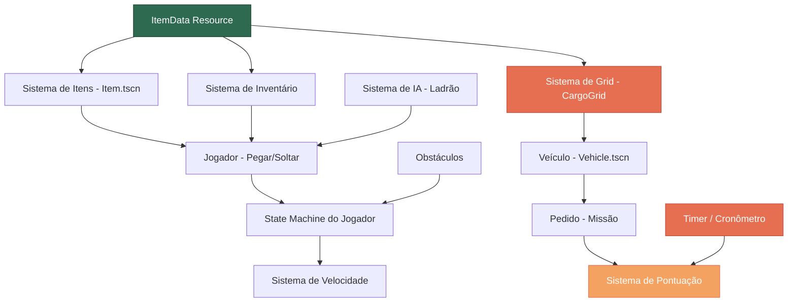

# 🎮 Ribeirinho Express — Análise Profunda

> Documento de análise do conceito, design, narrativa e viabilidade técnica do jogo.
> Última atualização: 30/04/2026

---

## 1. Visão Geral do Projeto

| Aspecto          | Detalhe                                                    |
| ---------------- | ---------------------------------------------------------- |
| **Nome**         | Ribeirinho Express                                         |
| **Engine**       | Godot 4.6 (GDScript)                                      |
| **Renderizador** | GL Compatibility (OpenGL)                                  |
| **Física**       | Jolt Physics                                               |
| **Gênero**       | Puzzle Estratégico / Logística / Top-Down                  |
| **Plataforma**   | PC (teclado + mouse)                                       |
| **Tema**         | Logística amazônica — transporte fluvial de suprimentos    |
| **Referências**  | Tetris (encaixe), Overcooked (pressão/tempo), Papers Please (decisão sob pressão) |

---

## 2. Análise do Conceito e Narrativa

### 2.1 Pontos Fortes da Proposta

**🌟 Originalidade temática excepcional.**
O cenário amazônico como pano de fundo para um puzzle logístico é algo praticamente inédito no mercado de jogos. Isso oferece:

- **Identidade visual única:** Rios barrentos, vegetação densa, barcos de madeira, pixel art regionalista — tudo isso diferencia o jogo instantaneamente de qualquer outro puzzle.
- **Relevância social:** O jogo aborda um problema real (a dificuldade logística na Amazônia) de forma lúdica. Isso abre portas para editais de cultura, educação e até ONGs.
- **Apelo emocional:** O jogador não está empilhando caixas "por empilhar". Ele está garantindo que medicamentos cheguem a comunidades isoladas. Isso gera propósito e engajamento.

**🧩 Mecânica central sólida.**
O conceito de "Tetris em um barco com timer" é intuitivo, fácil de explicar e difícil de dominar — a fórmula clássica de jogos viciantes.

**📈 Escalabilidade natural.**
A progressão (centro de distribuição → porto → rio → comunidade) oferece uma curva de dificuldade orgânica sem precisar inventar mecânicas artificiais.

### 2.2 Riscos e Pontos de Atenção

| Risco | Severidade | Descrição | Mitigação |
| ----- | ---------- | --------- | --------- |
| **Monotonia** | 🟡 Média | Encaixar blocos pode ficar repetitivo rapidamente se não houver variação | Introduzir itens especiais, eventos aleatórios (chuva, ladrão), e formatos novos a cada fase |
| **Complexidade do Grid** | 🔴 Alta | O sistema de grid estilo Tetris com regras de peso/fragilidade é tecnicamente complexo | Começar com grid simples (sem regras) e adicionar regras incrementalmente |
| **Conflito de mecânicas** | 🟡 Média | O documento descreve DUAS mecânicas: movimentação top-down do personagem E encaixe de peças com mouse. A transição entre elas precisa ser fluida | Definir claramente quando o jogador "entra" no modo puzzle vs. modo exploração |
| **Scope creep** | 🔴 Alta | O documento menciona IA de ladrão, obstáculos, state machine, veículos — tudo isso é muito para um primeiro protótipo | Focar no MVP primeiro, depois expandir |

### 2.3 Análise da Dualidade de Gameplay

O documento descreve dois "modos" implícitos:

```
┌─────────────────────────────────────────────┐
│  MODO EXPLORAÇÃO (Top-Down)                 │
│  - Jogador anda pelo cenário (WASD)         │
│  - Pega itens do chão/estoque               │
│  - Leva até o barco/veículo                 │
│  - Obstáculos e ladrões no caminho          │
└──────────────────────┬──────────────────────┘
                       │ (pressiona E / clica no barco)
                       ▼
┌─────────────────────────────────────────────┐
│  MODO PUZZLE (Grid/Tetris)                  │
│  - Câmera foca no grid do barco             │
│  - Arrastar e soltar itens com mouse        │
│  - Rotacionar com R / botão direito         │
│  - Regras de peso e fragilidade             │
└─────────────────────────────────────────────┘
```

> **Decisão crítica:** No MVP, recomendo que esses dois modos coexistam na MESMA tela (câmera fixa top-down mostrando o personagem E o grid do barco ao lado). Isso evita transições complexas e mantém a urgência do timer visível o tempo todo.

---

## 3. Análise do Estado Atual do Código

### 3.1 O que já existe

| Arquivo | Status | Descrição |
| ------- | ------ | --------- |
| `project.godot` | ✅ Configurado | Godot 4.6, GL Compatibility, Jolt Physics, inputs mapeados (WASD + E) |
| `scenes/main.tscn` | ✅ Básico | Cena raiz com Node2D + instância do Player |
| `scenes/player.tscn` | ✅ Completo | CharacterBody2D com AnimatedSprite2D (spritesheet 32x32, 6 animações de 6 frames cada) e Hitbox (Area2D) |
| `scripts/player.gd` | ✅ Funcional | Movimentação WASD, animações direcionais (idle/run × up/down/right), flip horizontal, hitbox que acompanha a direção |
| `assets/images/player/Player.png` | ✅ Presente | Spritesheet do jogador (192x192, grid 6×6 de tiles 32x32) |

### 3.2 Revisão do `player.gd` — Problemas encontrados

#### 🔴 Bug: `JUMP_VELOCITY` não utilizado
```gdscript
const JUMP_VELOCITY = -400.0  # ← Resíduo do template padrão do Godot
```
O jogo é top-down, não tem gravidade nem pulo. Essa constante deve ser removida.

#### 🟡 Redundância: `process_animation` chamada duas vezes
```gdscript
func _physics_process(_delta: float) -> void:
    process_movement()           # ← chama process_animation internamente
    process_animation(last_direction)  # ← chama de novo aqui
    move_and_slide()
```
A função `process_movement()` já chama `process_animation()` na linha 35. Chamá-la novamente no `_physics_process` é desnecessário.

#### 🟡 Atribuição estranha ao parar
```gdscript
velocity = direction * Vector2.ZERO  # ← sempre resulta em Vector2.ZERO
```
Funciona, mas é confuso. Deveria ser simplesmente:
```gdscript
velocity = Vector2.ZERO
```

#### 🟢 Sugestão: Normalizar direção diagonal
Atualmente, ao andar na diagonal (ex: W+D), a velocidade é `~424` em vez de `300`, porque o vetor não é normalizado. O `get_vector()` do Godot 4 já retorna normalizado, então isso já está OK na prática — mas vale confirmar.

#### 🟢 Sugestão: Hitbox no modo diagonal
A hitbox só se reposiciona para as 4 direções cardinais (`Vector2.LEFT`, `RIGHT`, `UP`, `DOWN`). Se o jogador andar na diagonal, a hitbox não se atualiza (o `match` não encontra correspondência). Considerar adicionar diagonais ou usar o ângulo do vetor.

---

## 4. Análise da Arquitetura Planejada

### 4.1 Mapa de Dependências dos Sistemas



### 4.2 Avaliação da Arquitetura

| Decisão | Avaliação | Comentário |
| ------- | --------- | ---------- |
| Usar `Resource` para dados de itens | ✅ Excelente | Padrão correto do Godot 4. Permite criar itens no editor sem código |
| Inventário como `Array[ItemData]` | ✅ Bom | Simples e funcional para o escopo |
| State Machine com enum | ✅ Bom | Para 4 estados simples, enum + match é suficiente. Não precisa de State Machine com nodes separados ainda |
| Grid usando TileMap | 🟡 Atenção | TileMap é bom para o **visual**, mas a **lógica** do grid deve ficar em um Array2D separado. Não confundir camada visual com camada de dados |
| Categoria como `int` no ItemData | 🟡 Melhorar | Usar `enum` tipado em vez de `int` puro para evitar magic numbers |
| Formato como `Array` genérico | 🟡 Especificar | Precisa definir a estrutura. Recomendo `Array[Vector2i]` representando as células ocupadas relativas à origem do item |

---

## 5. Análise das Mecânicas de Jogo

### 5.1 Sistema de Encaixe (Core Loop)

O coração do jogo é o encaixe de peças. Cada item ocupa um formato no grid:

```
Caixa Pequena (1x1):    Caixa Média (2x1):     Caixa L (2x2 - L):
┌───┐                   ┌───┬───┐              ┌───┬───┐
│ ■ │                   │ ■ │ ■ │              │ ■ │   │
└───┘                   └───┴───┘              ├───┼───┘
                                               │ ■ │
                                               └───┘

Geladeira (1x3):        Saco de Grãos (2x2):   Medicamentos (1x1):
┌───┐                   ┌───┬───┐              ┌───┐
│ ■ │                   │ ■ │ ■ │              │ + │
├───┤                   ├───┼───┤              └───┘
│ ■ │                   │ ■ │ ■ │
├───┤                   └───┴───┘
│ ■ │
└───┘
```

### 5.2 Regras de Posicionamento

| Categoria   | Regra                                                              | Justificativa narrativa                    |
| ----------- | ------------------------------------------------------------------ | ------------------------------------------ |
| **PESADO**  | Só pode ser colocado na fileira inferior (chão do barco)           | Pesado demais para empilhar                |
| **MÉDIO**   | Pode ser colocado em qualquer lugar                                | Flexível                                   |
| **FRÁGIL**  | Não pode ter item pesado diretamente acima                         | Quebraria com o peso                       |

### 5.3 Sistema de Pontuação (Proposta)

```
PONTUAÇÃO = (espaço_usado / espaço_total) × 100   →  Eficiência de Espaço
           + (itens_essenciais × bonus_essencial)  →  Priorização
           + (tempo_restante × bonus_tempo)        →  Velocidade
           - (itens_danificados × penalidade)      →  Cuidado com frágeis
```

**Metas por nível:**
- ⭐ 1 estrela: ≥ 50% do espaço preenchido
- ⭐⭐ 2 estrelas: ≥ 75% + todos os essenciais
- ⭐⭐⭐ 3 estrelas: ≥ 90% + essenciais + bônus de tempo

---

## 6. Identidade Visual e Sonora

### 6.1 Paleta de Cores Sugerida

| Elemento            | Cor sugerida | Hex       |
| ------------------- | ------------ | --------- |
| Água do rio         | Marrom turvo | `#8B6914` |
| Vegetação           | Verde escuro | `#2D5016` |
| Madeira do barco    | Marrom médio | `#8B5E3C` |
| Caixas normais      | Bege/Papelão | `#C4A882` |
| Itens essenciais    | Vermelho     | `#D32F2F` |
| Frágeis             | Azul claro   | `#64B5F6` |
| UI / Timer          | Amarelo      | `#FFB300` |
| Fundo do galpão     | Cinza        | `#616161` |

### 6.2 Estilo Visual

- **Pixel art 32x32** (já confirmado pelo spritesheet do jogador)
- **Câmera top-down** fixa, sem scroll
- **Escala 4x** no player (confirmado no `player.tscn`: `scale = Vector2(4, 4)`)
- Manter todos os assets na mesma escala de pixel para consistência visual

### 6.3 Sugestão de Trilha Sonora

| Momento                  | Estilo                                              |
| ------------------------ | --------------------------------------------------- |
| Menu principal           | Violão e sons de floresta (calmo)                   |
| Gameplay normal          | Percussão + flauta amazônica, ritmo constante       |
| Últimos 30 segundos      | Acelera o BPM + adiciona batida eletrônica urgente   |
| Conclusão com sucesso    | Fanfarra curta com instrumentos regionais            |
| Falha (tempo esgotado)   | Buzina de barco + som de desânimo                    |

---

## 7. Comparação com Jogos Semelhantes

| Jogo | Semelhança | O que Ribeirinho Express faz diferente |
| ---- | ---------- | -------------------------------------- |
| **Tetris** | Encaixar peças em grid | Tem narrativa, regras de peso/fragilidade, e movimentação de personagem |
| **Overcooked** | Pressão de tempo, trabalho logístico | É single-player e focado em puzzle espacial, não em coordenação |
| **Papers, Please** | Decisão sob pressão, consequências sociais | Foco em otimização espacial em vez de análise documental |
| **Wilmot's Warehouse** | Organização espacial, categorização | Grid com regras físicas (peso/fragilidade) em vez de organização livre |
| **Unpacking** | Colocar objetos em espaços | Timer e pontuação adicionam pressão competitiva |

---

## 8. Público-Alvo

- **Primário:** Jogadores casuais que gostam de puzzles (15-35 anos)
- **Secundário:** Estudantes e educadores (potencial educativo sobre logística amazônica)
- **Terciário:** Comunidade indie brasileira e internacional interessada em jogos com identidade cultural

---

## 9. Potencial de Expansão (Pós-lançamento)

1. **Modo cooperativo local** — Dois jogadores organizando o mesmo barco
2. **Modo competitivo** — Quem carrega mais rápido
3. **Editor de níveis** — Jogadores criam seus próprios cenários
4. **Mobile** — O Godot exporta para Android/iOS; a mecânica de arrastar funciona bem em touch
5. **Cenários extras** — Outros biomas brasileiros (Pantanal, Sertão, Litoral)
6. **História expandida** — Cutscenes mostrando as comunidades recebendo os suprimentos

---

## 10. Conclusão

O **Ribeirinho Express** tem uma proposta com potencial real. A combinação de puzzle acessível + tema social relevante + identidade visual brasileira é uma receita rara no mercado de jogos indie.

O maior risco é tentar implementar tudo de uma vez. O roadmap técnico no documento seguinte (`02_roadmap_tecnico.md`) detalha exatamente o que deve ser feito primeiro para chegar a um protótipo jogável o mais rápido possível.
